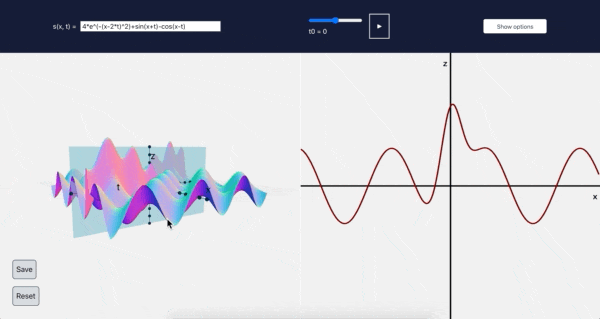

# Vibrating string app

Graphs a function of two variables, s(x,t), and animates a fixed value
of the second variable, called t0. Graphs the function s(x,t0) next to
the 3d graph of s(x,t), so one can see how s(x,t0) changes as t0 changes.

[jesseburke.org/apps/vibrating-string/](https://jesseburke.org/apps/vibrating-string)



## Implementation details

 The libraries
[@jesseburke/three-scene-with-react](https://github.com/jesseburke/three-scene-with-react)
and
[@jesseburke/jotai-data-setup](https://github.com/jesseburke/jotai-data-setup)
are used.

More speficially, the entire page and program is a single React component named App,
with the following structure:
```javascript
function App() {
    return (
        <JotaiProvider>
			<header>
				<funcAtom.component/>
				<animationDataAtom.component/>
				<OptionsModal/>
			</header>
			<main>
				<ThreeSceneComp>
					<Axes3d/>
					<Grid/>
					<FunctionGraph3D/>
					<Plane/>
					<CameraControls/>
				</ThreeSceneComp>
				<CanvasComp>
					<Axes2D/>
					<FunctionGraph2D/>
				</CanvasComp>
				<DataComp/>
			</main>
        </JotaiProvider>
    );
}
```
